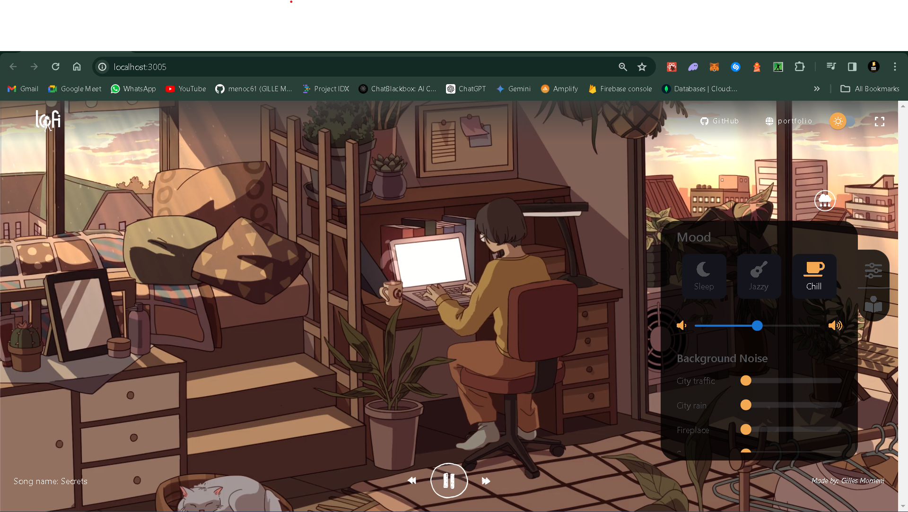
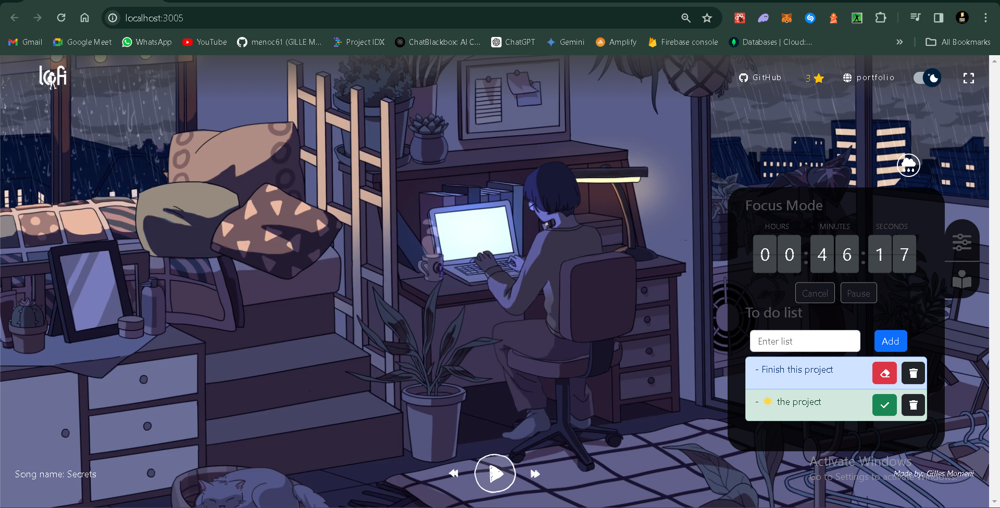

# Lofi Music Website

This project is a lofi music website built using React.js. It provides a soothing and relaxing experience for users who enjoy listening to lofi music. The website is designed to create a calming ambiance with its minimalistic and aesthetically pleasing interface. This project was inspired by my love of listening to lofi music from YouTube while coding.

>If you like the project, please give it a star and consider contributing by finishing or updating the to-do list with tasks you want me to complete. Feel free to contribute to this little fun project.




## Features

- **Music Player**: The website includes a music player that allows users to play, pause, skip, and control the volume of the lofi music tracks.

## Installation

1. Clone the repository

    ```sh
    git clone https://github.com/menoc61/lofi-music-website.git
    ```

2. Navigate to the project directory

    ```sh
    cd lofi-music-website
    ```

3. Install the dependencies

    ```sh
    yarn install
    ```

4. Start the development server

    ```sh
    yarn start
    ```

5. Open your browser and visit `http://localhost:3000`

## To-Do Checklist

### Project Initialization

- [x] Create a basic React project
- [x] Add sound and image theme transitions effect

### Features and Enhancements

- [x] Implement a dark mode toggle for better user experience during nighttime listening
- [ ] Integrate GitHub login to allow the user to import songs from a private GitHub playlist
- [ ] Integrate Spotify or any free music API to fetch music from the user's playlist on the given cloud platform
- [ ] Create a bookmarking feature where the user can save all their favorite music in IndexedDB for persistent storage or local storage if the browser does not support IndexedDB
- [ ] Add user profile management to personalize the experience

### UI/UX Improvements

- [ ] Enhance the user interface with more interactive animations
- [ ] Optimize the website for mobile devices
- [ ] Add a customizable background option for users

### Performance and Optimization

- [ ] Optimize the codebase for better performance
- [ ] Reduce the bundle size by using code splitting and lazy loading

### Documentation

- [ ] Update this README.md with more detailed instructions
- [ ] Create a contribution guide for new contributors
- [ ] Document the API endpoints used in the project

Feel free to add any additional tasks you think are necessary to improve this project. Let's collaborate and make this lofi music website an amazing place for lofi lovers!
